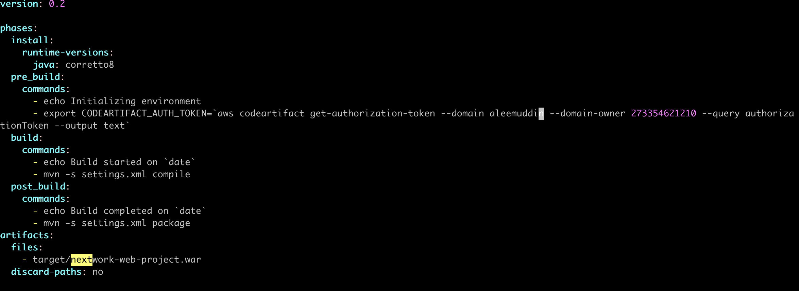

# P4 - Package an App with CodeBuild

**Author:** Aleemuddin Mohammad  
**Email:** aleem2747@gmail.com

---

## Package an App with CodeBuild

---

## Introducing today's project!

### What is AWS CodeBuild?

AWS CodeBuild is a fully managed build service that compiles source code, runs tests, and produces software packages. It's useful for automating build processes, ensuring consistent and quick delivery of applications.

### How I used CodeBuild in this project

Today, I used AWS CodeBuild to build our web app's build process. It compiled and zip file was created in S3, ensuring changes were immediately. 

### One thing I didn't expect in this project was...

One unexpected aspect was the complexity of setting up the buildspec file in AWS CodeBuild to correctly handle dependencies and commands.

### This project took me...

This  mini project took me around 30 minutes. 

---

## Set up an S3 bucket

I started my project by creating an S3 bucket because, I want S3 to store files that gets created during the build process. 

The key artifact that this S3 bucket will capture is called Build artifacts are files that get created from this build process. For our project, we want our build process to create one build artifact that packages up everything a server could need to

This artifact is important because it works just like a zip file - a server will simply "unzip" your WAR file to find a bunch of files and resources. 

---

## Set up a CodeBuild project

### Source

My CodeBuild project's Source configuration means the location of the code that CodeBuild will fetch, compile, and package into a WAR file and I selected GitHub as the project's source

### Environment

My CodeBuild project's Environment configuration means  pre-configured versions of the build environment so you won't need to install all the software/tools/settings required to build a project and I selected  we choose Managed image here.

### Artifacts

My CodeBuild project's Artifacts configuration means that the output files CodeBuild generates, like compiled code, are packaged into a WAR file named nextwork-web-build.zip, and I selected Amazon S3 for storage.

### Logs

My project's Logs configuration means that all operational data during the build process is captured and stored. I selected CloudWatch for real-time logging and monitoring, setting the group name to nextwork-build-logs and stream prefix to webapp.

---

## Create a buildspec.yml file

I created a buildspec.yml file in my project because it configures the commands that CodeBuild will run line by line to build your web app. Having a file makes sure that every build follows the same steps and produces consistent results.

---

## Create a CodeBuild build project

### My buildspec.yml file has four stages

The first two phases in my buildspec.yml file tells about installing the java runtime and pre-build commands to initialize environment and export codeartifact token.

The third phase in my buildspec.yml file is echo Build started on date which tells the terminal to print out "Build started on" followed by the current date and time, indicating the start of the build process.

The fourth phase in my buildspec.yml file is post build phase which tells to print build complete and other command tells maven to compile settings 

---

## Modify CodeBuild’s IAM role

### Before building my CodeBuild project, I modified its service role first. 

My CodeBuild project's service role was first created when I was setting up the build environment with CodeBuild

I attatched a new policy called codeartifact-aleemuddin-consumer-policy 

Attaching this policy means it can fetch the necessary packages it needs to complete our web app's build process.

---

## My first project build 💪

To build my project, all I had to do was to select start build in codebuild

The build process in CodeBuild took around 3-4 minutes

Once the build is complete, I checked if the associated s3 bucket had the zip file in it. 

I saw nextwork-wev-build.zip file , which verified that the build was completed successfully. 

---

---
